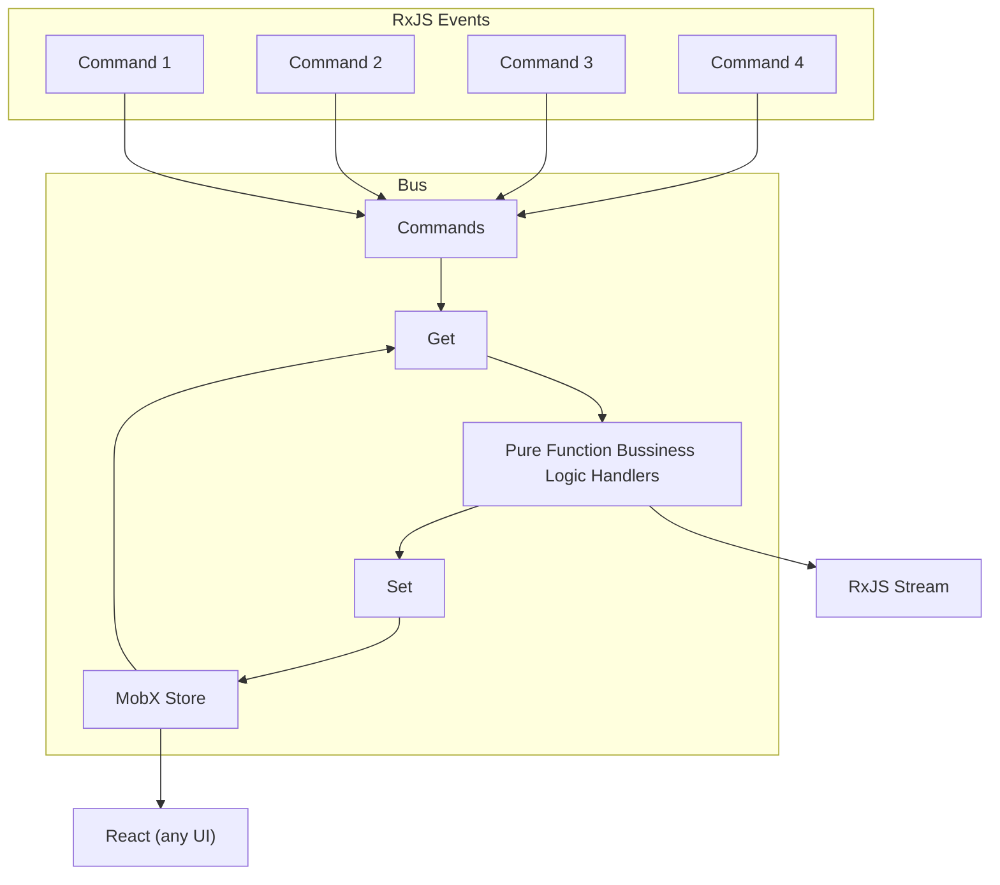

# Mo'Bus
Supercharge your state management with events, and predictable pure function state machines.

Adapt any existing class, MobX store, or Javascript Object to be event driven. Great for 3D projects in ThreeJS.

## Installation
`npm i mobus`

## Why?
You are looking for:
- pure function state machines, to avoid the pain from side effects
- event driven architecture, streaming solutions, or functional reactive programming
- how to leverage the power of RxJS (EGs in React with MobX)

## Example
https://github.com/jtmckay/mobus/tree/main/examples/preact

### Control state with commands
```ts
import { definedEntity, stateMachineFactory } from 'mobus';

export const counterStore = { count: 0 }

export const { commandFactory, subscribe } = stateMachineFactory('counter', {
  storeSingle: counterStore
});
subscribe();

export const increment = commandFactory<void>({
  eventHandler: (entity) => {
    const counter = definedEntity(entity)
    counter.count++;
    return counter
  }
})
```

### If you need it in a render cycle (EG: React with MobX)
```ts
import { definedEntity, stateMachineFactory } from 'mobus';
import { observable, runInAction } from 'mobx';

export const counterStore = observable({ count: 0 })

export const { commandFactory, subscribe } = stateMachineFactory('counter', {
  wrapper: runInAction,
  storeSingle: counterStore
});
```
Then render it in React, Preact etc.
```tsx
import { increment, counterStore } from '../../domain/counter/counter.bus';
import { observer } from 'mobx-react-lite';

const Counter = observer(() => (
  <div onClick={() => increment()}>
    Counter: {counterStore.count}
	</div>
));
```

### Optimistic updates
This example uses a more advanced store. EG: Map<string, Pedometer>.
```ts
import { stateMachineFactory } from 'mobus';
import { pedometerStore } from './pedometer.store';

export const { commandFactory, subscribe } = stateMachineFactory(ENTITY, { wrapper: runInAction, store: pedometerStore });
subscribe();

const syncHeartRate = commandFactory<WithID & { rate: number }>({
  eventHandler: (entity, event) => {
    // EG: optional eventHandler immediately updates the state
    const pedometer = definedEntity(entity);
    pedometer.heartRate = event.payload.rate;
    return pedometer;
  },
  asyncEventHandler: async (entity, event) => {
    // EG: optional asyncEventHandler will update the state again (after hitting server etc.)
    const pedometer = definedEntity(entity);
    await new Promise((resolve) => setTimeout(resolve, 2000));
    runInAction(() => {
      pedometer.heartRate = 100;
    });
    return pedometer;
  },
});
```

### Parallel handlers
By default, all stores will only handle one event at a time, and will queue any events that are triggered in the meantime.
```ts
import { stateMachineFactory } from 'mobus';
import { pedometerStore } from './pedometer.store';

export const { commandFactory, subscribe } = stateMachineFactory(ENTITY, {
  wrapper: runInAction,
  store: pedometerStore,
  parallel: true, // Setting parallel to true will allow multiple async handlers to fire simultaneously
});
```

### Testing
Incredibly simple testing when compared to most RxJS implementations, because it exposes a promise that can be awaited.
```ts
describe('when incrementing the counter with a delay', () => {
  beforeEach(async () => {
    await delayedIncrement()
  });

  it('increases the count to 1', () => {
    expect(counterStore.count).toBe(1)
  });
});
```

### Future examples
With events driving the system, it is trivial to develop advanced features for your product such as:
- stream interactions over websockets for live collaboration
- analytics for user engagement or business changelog


## Flow


## Developing & Publishing
`yarn build`

`cd package`

`npm login --auth-type=legacy`

`npm publish`
