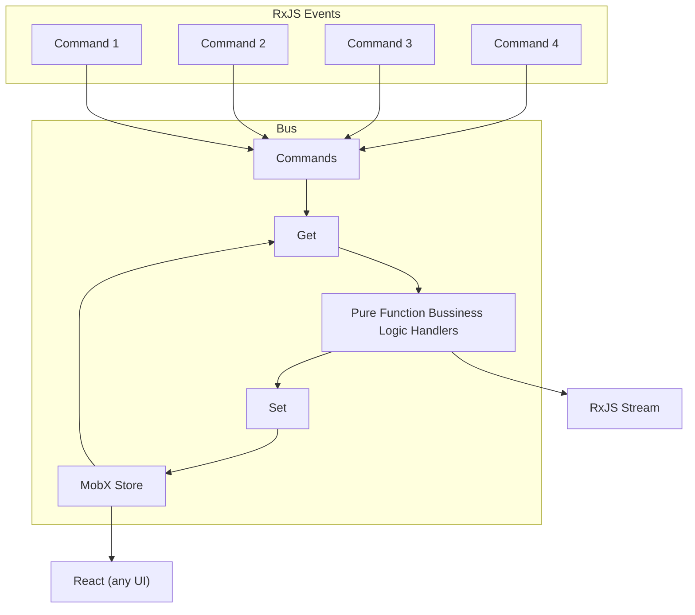

# mobus
RxJS events into a MobX state machine

## Installation
`yarn`

## Flow


## Try
`cd preact-example`

`yarn`

`yarn dev`

### Example store

```
import { observable } from 'mobx';

export type Pedometer = {
  id: string;
  stepCount: number;
};

export const pedometerStore = observable<string, Pedometer>(new Map());
```

### Example bus

```
import {
  stateMachineFactory
} from 'mobus';
import { Subject } from 'rxjs';
import { ENTITY } from './pedometer.constants';
import { pedometerStore } from './pedometer.store';

// eslint-disable-next-line @typescript-eslint/no-explicit-any
const command$ = new Subject<any>();
export const pedometer$ = stateMachineFactory(ENTITY, pedometerStore, command$, { parallel: true });

// Start the engine immediately. More advanced: subscribe as needed
pedometer$.subscribe();
```

### Example optimistic updates

```
const syncHeartRate = commandFactory<WithID & { rate: number }, Pedometer>({
  command$,
  cud: CUD.update,
  eventType: EVENT.Rate,
  eventHandler: (entity, event) => {
    const pedometer = definedEntity(entity);
    pedometer.heartRate = event.payload.rate;
    return pedometer;
  },
  asyncEventHandler: async (entity, event) => {
    const pedometer = definedEntity(entity);
    await new Promise(resolve => setTimeout(resolve, 2000))

    runInAction(() => {
      pedometer.heartRate = 100;
    });
    return pedometer;
  }
});
```

## Publish
`yarn build`

`cd package`

`npm login --auth-type=legacy`

`npm publish`
